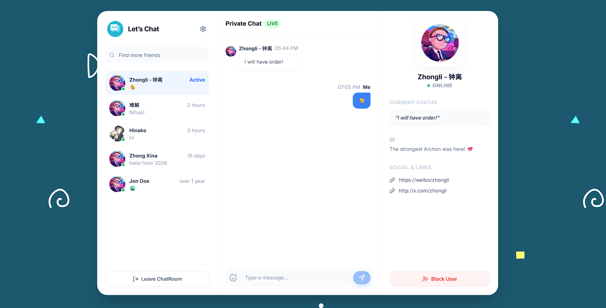

# Next ChatRoom Rebuild 🚀

A modern, real-time chat application rebuilt with Next.js 14, Firebase, and Tailwind CSS. This project demonstrates a clean, responsive UI with robust real-time capabilities.



## ✨ Key Features

- **Real-time Messaging**: Instant message delivery using Cloud Firestore.
- **Authentication**: Secure Email/Password login and registration via Firebase Auth.
- **Modern UI**: Built with [Shadcn UI](https://ui.shadcn.com/), Tailwind CSS, and Lucide Icons for a sleek, accessible design.
- **User Management**:
  - Search and add users.
  - User profiles with status and bio.
  - Block/Unblock functionality.
- **Rich Interactions**:
  - Emoji picker integration.
  - Image sharing (via Firebase Storage).
  - Responsive design for mobile and desktop.
- **State Management**: Efficient global state handling with Zustand.
- **Type Safety**: Full TypeScript support with Zod schema validation.

## 🛠️ Tech Stack

- **Framework**: [Next.js 14](https://nextjs.org/) (App Router)
- **Language**: TypeScript
- **Styling**: Tailwind CSS, Tailwind Merge, CLSX
- **UI Components**: Radix UI (primitives), Shadcn UI
- **Backend / BaaS**: Firebase (Auth, Firestore, Storage)
- **State Management**: Zustand
- **Form Handling**: React Hook Form + Zod
- **Icons**: Lucide React
- **Deployment**: Firebase Hosting

## 🚀 Getting Started

### Prerequisites

- Node.js (v18 or higher recommended)
- npm or yarn

### Installation

1.  **Clone the repository:**

    ```bash
    git clone https://github.com/alohadancemeow/next-chatroom-rebuild.git
    cd next-chatroom-rebuild
    ```

2.  **Install dependencies:**

    ```bash
    npm install
    ```

3.  **Environment Configuration:**

    Create a `.env.local` file in the root directory and add your Firebase configuration key:

    ```bash
    NEXT_PUBLIC_API_KEY=your_firebase_api_key
    ```

    _Note: Other Firebase config values (projectId, authDomain, etc.) are currently hardcoded in `lib/firebase.ts`. You may want to move them to env vars for a custom setup._

4.  **Run the development server:**

    ```bash
    npm run dev
    ```

    Open [http://localhost:3000](http://localhost:3000) with your browser to see the result.

### 🧪 Test Credentials

For quick testing, you can use the built-in demo account displayed on the login screen:

- **Email**: `test@example.com`
- **Password**: `123456`

## 📂 Project Structure

```
├── app/                # Next.js App Router pages and layouts
├── components/         # React components
│   ├── auth/           # Authentication forms (Login, Register)
│   ├── chat/           # Chat interface components
│   ├── search/         # User search and dialogs
│   ├── settings/       # User settings and profile management
│   └── ui/             # Reusable UI components (Shadcn)
├── helpers/            # Utility functions and validators
├── hooks/              # Custom React hooks
├── lib/                # Library configurations (Firebase, Utils)
├── states/             # Zustand stores
├── types/              # TypeScript type definitions and Zod schemas
└── public/             # Static assets
```

## 📜 Scripts

| Command         | Description                                        |
| :-------------- | :------------------------------------------------- |
| `npm run dev`   | Starts the development server.                     |
| `npm run build` | Builds the project for production (Static Export). |
| `npm start`     | Runs the production server.                        |
| `npm run lint`  | Runs ESLint to check for code quality.             |

## 🤝 Contributing

Contributions are welcome! Please feel free to submit a Pull Request.

